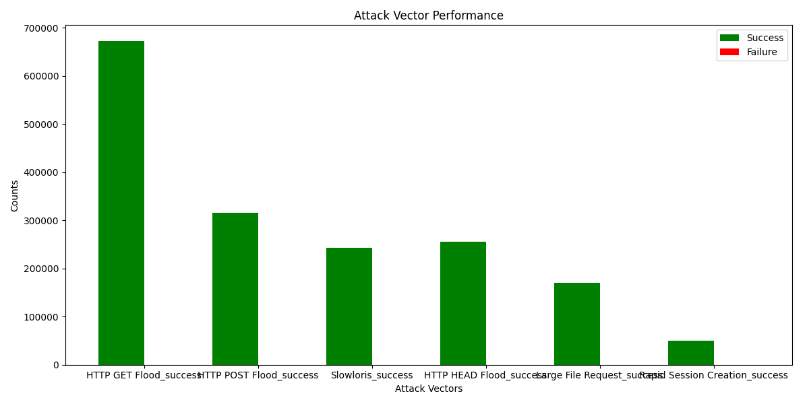
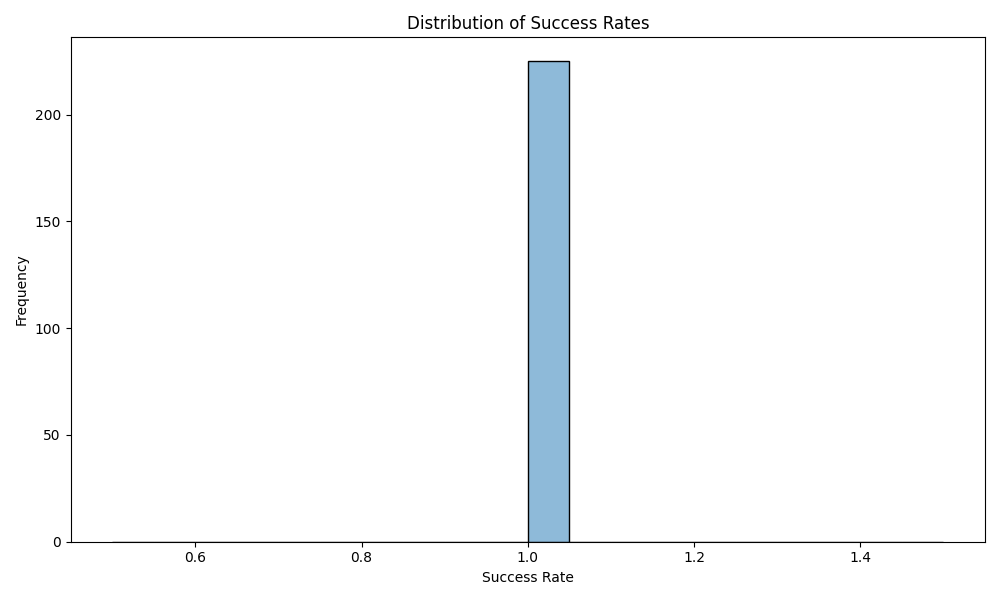
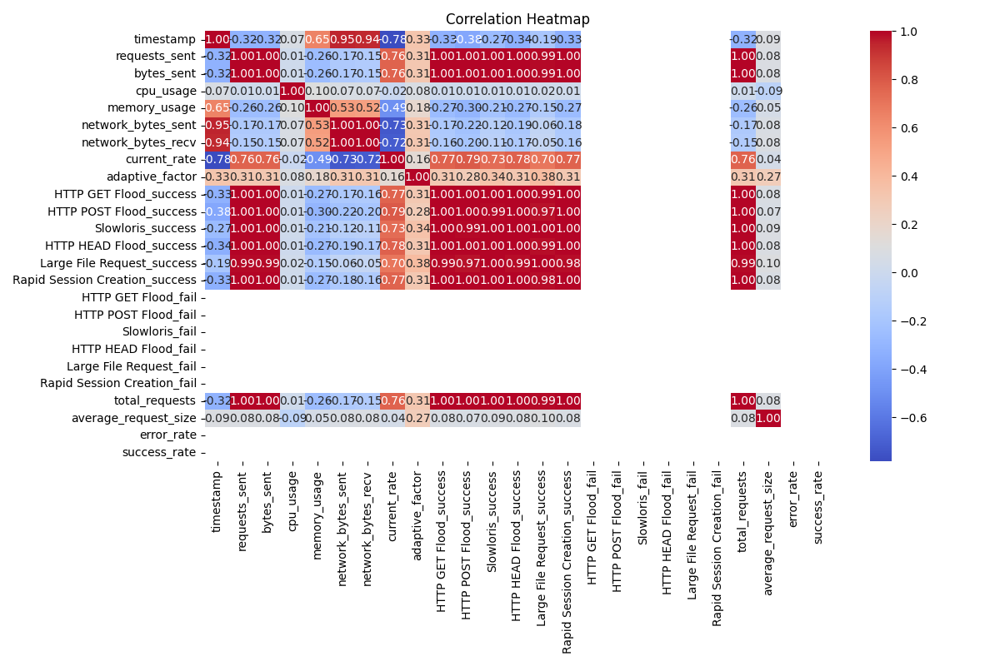
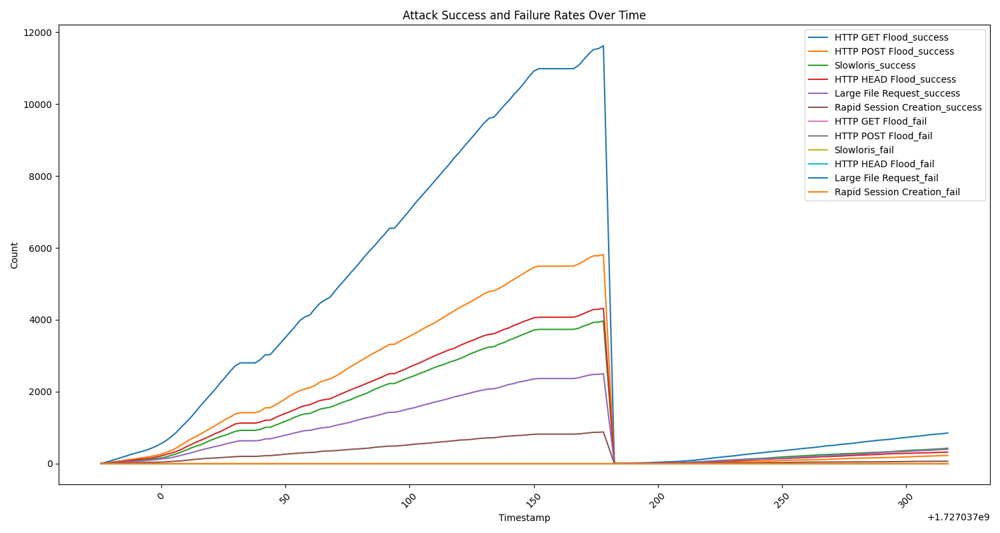

Here’s a README file in Markdown format for your project:

```markdown
# Attack Simulation Analysis

This project simulates various attack vectors against a target server and analyzes the results using advanced metrics and visualizations. The goal is to understand the performance of different attack strategies and their impact on server stability.

## Project Structure

- `data-extract.py`: This script processes the attack logs and computes advanced metrics.
- `analysis.py`: This script generates various visualizations based on the extracted data.
- `terminal_log.csv`: Logs of the terminal outputs during the attack simulation.
- `advanced_attack_log.csv`: Log of attack simulation results, including request counts and statuses.
- `detailed_attack_data.csv`: Processed log file with advanced metrics.
- Images/Charts generated from the analysis scripts.

## Setup and Usage

1. **Install Dependencies**: Make sure you have the necessary libraries installed. You can do this via pip:

   ```bash
   pip install pandas matplotlib seaborn
   ```

2. **Run the Data Extraction Script**:

   Execute `data-extract.py` to generate detailed metrics from the attack logs:

   ```bash
   python data-extract.py
   ```

3. **Run the Analysis Script**:

   After generating the metrics, run `analysis.py` to create visualizations:

   ```bash
   python analysis.py
   ```

## Visualizations

The following charts and images are generated from the analysis:

1. **Attack Vector Performance**  
     
   This bar chart displays the success and failure counts for each attack vector.

2. **Distribution of Success Rates**  
     
   A histogram showing the distribution of success rates during the attack simulations.

3. **Correlation Heatmap**  
     
   A heatmap illustrating the correlation between different metrics collected during the simulation.

4. **Error and Success Rates Over Time**  
     
   This line plot visualizes the error and success rates throughout the simulation period.

## Project Overview

The Attack Simulation Analysis project provides a comprehensive framework for simulating server attacks, collecting performance data, and conducting detailed analyses. By employing various attack vectors, the project aims to highlight potential vulnerabilities and performance issues in server configurations.

### Key Features

- **Multiple Attack Vectors**: Simulates various types of HTTP attacks.
- **Advanced Metrics**: Computes total requests, average request size, and error rates.
- **Data Visualization**: Generates insightful charts to aid in understanding attack impacts.

## License

This project is licensed under the MIT License.

## Acknowledgements

- [Pandas](https://pandas.pydata.org/) for data manipulation.
- [Matplotlib](https://matplotlib.org/) and [Seaborn](https://seaborn.pydata.org/) for data visualization.
```

Feel free to modify any sections to better fit your project’s needs!